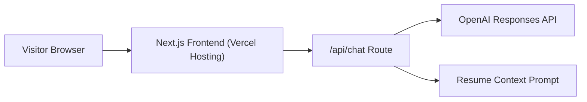

# Allen He Portfolio (Next.js + Vercel + AI)

A senior-level full stack portfolio designed to showcase architecture, cloud deployment, and AI product integration.

## Stack

- Frontend: Next.js (App Router)
- Hosting: Vercel
- AI: `/api/chat` route using OpenAI Responses API
- Optional extension: AWS DynamoDB guestbook/hit counter

## Local setup

```bash
npm install
cp .env.example .env.local
npm run dev
```

Open [http://localhost:3000](http://localhost:3000).

### Local test checklist

1. Put your real Cloudflare values in `.env.local`:
   - `AI_PROVIDER=cloudflare`
   - `CLOUDFLARE_ACCOUNT_ID=...`
   - `CLOUDFLARE_API_TOKEN=...`
2. Run dev server:
   - `npm run dev`
3. Test the API route:
   - `npm run test:chat`

## AI feature

The `POST /api/chat` endpoint injects resume context and answers user questions about skills, AWS experience, and projects.

Supported providers:

- `AI_PROVIDER=cloudflare` (recommended free path)
- `AI_PROVIDER=ollama`
- `AI_PROVIDER=openai`

Cloudflare Workers AI vars:

- `CLOUDFLARE_ACCOUNT_ID`
- `CLOUDFLARE_API_TOKEN`
- `CLOUDFLARE_MODEL` (default: `@cf/meta/llama-3.1-8b-instruct`)

OpenAI vars:

- `OPENAI_API_KEY`
- `OPENAI_MODEL` (optional)

Ollama vars:

- `OLLAMA_BASE_URL` (example: `http://localhost:11434` for local dev)
- `OLLAMA_MODEL` (example: `llama3.1:8b`)

## Ollama + Vercel constraint

Vercel cannot run an Ollama model server inside your deployment. If you choose Ollama, host Ollama separately and let Vercel call it over HTTPS.

Working setup:

- Frontend/API route on Vercel
- Ollama on another machine/VM with a public endpoint
- `AI_PROVIDER=ollama` + `OLLAMA_BASE_URL=https://your-ollama-host`

## Architecture



## Vercel deployment

1. Push this repo to GitHub.
2. In Vercel, choose **Add New Project** and import the repository.
3. In Vercel Project Settings -> Environment Variables, add:
   - For Cloudflare Workers AI (recommended): `AI_PROVIDER=cloudflare`, `CLOUDFLARE_ACCOUNT_ID`, `CLOUDFLARE_API_TOKEN`, `CLOUDFLARE_MODEL` (optional)
   - For OpenAI: `AI_PROVIDER=openai`, `OPENAI_API_KEY`, `OPENAI_MODEL` (optional)
   - For Ollama: `AI_PROVIDER=ollama`, `OLLAMA_BASE_URL`, `OLLAMA_MODEL`
4. Deploy. Vercel handles Next.js build, serverless API routes, HTTPS, and CI/CD automatically.
5. (Optional) Attach your custom domain in Vercel Domains.

### Vercel CLI (optional)

```bash
npm i -g vercel
vercel
vercel --prod
```

## Talking points for interviews

- The portfolio is built as a production-grade application, not a static resume.
- Architecture includes a front-end experience layer, serverless API route for AI, and cloud-native deployment pipeline through Vercel.
- The featured project section frames business problem, technical decisions, and measurable impact.

## Suggested next improvements

- Add DynamoDB-backed guestbook.
- Add analytics and performance tracking.
- Add markdown-driven case study pages under `/projects/[slug]`.
